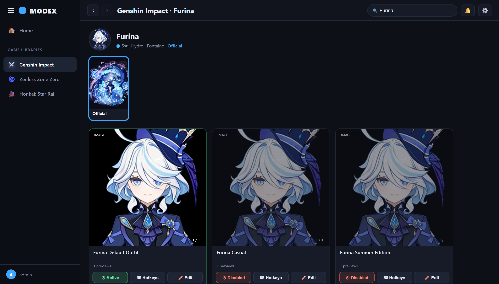
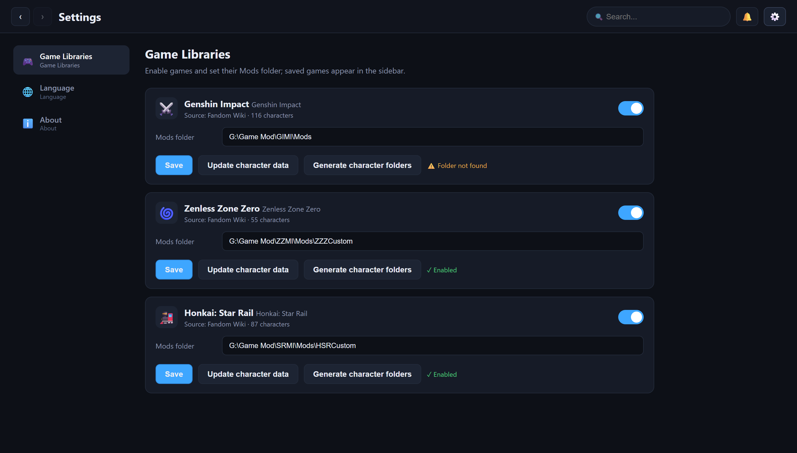
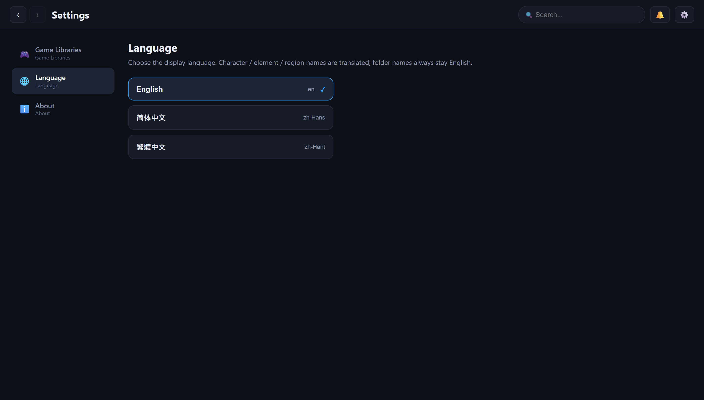
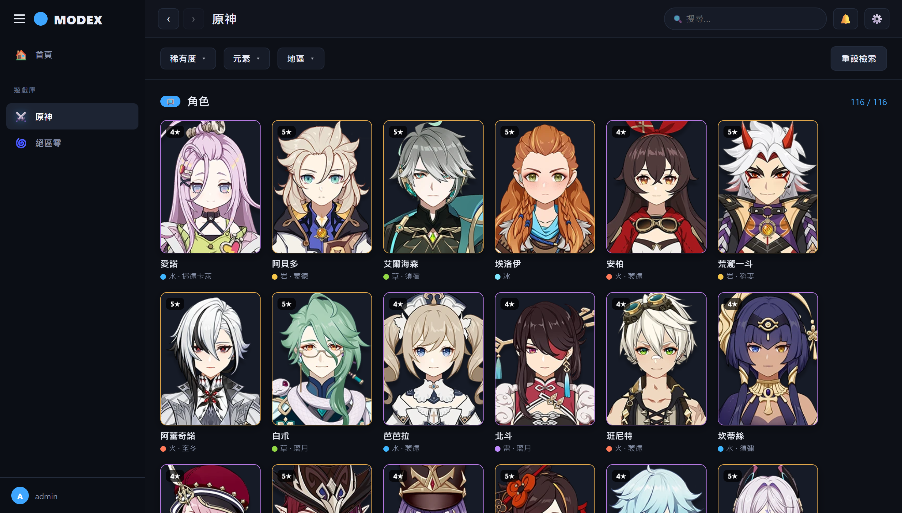
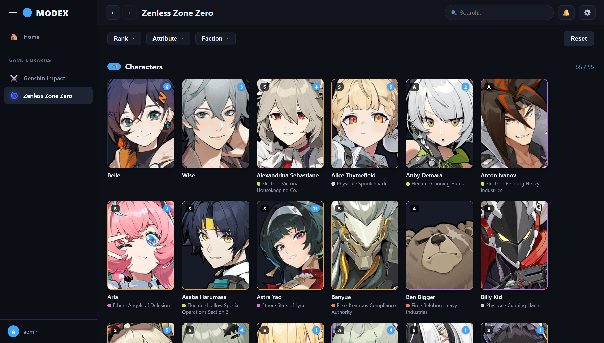

# MODEX — Mod Index

An Emby-style, browser-based **mod manager** for character mods (3DMigoto / GIMI / ZZMI style folders). Browse installed character mods like a media library, switch skins on/off, view in-game hotkeys, and manage preview images — all from a clean web UI.<br>
Emby 風格、瀏覽器操作的**遊戲角色 Mod 管理器**（對應 3DMigoto / GIMI / ZZMI 的資料夾結構）。像媒體庫一樣瀏覽已安裝的角色模組、切換造型開關、查看遊戲內快捷鍵、管理預覽圖 —— 全在乾淨的網頁介面完成。

> Frontend: HTML / CSS / vanilla JS · Backend: Python (Flask)<br>
> 前端：HTML / CSS / 原生 JS · 後端：Python（Flask）

## Supported games / 目前支援的遊戲

| Game / 遊戲 | Filters / 篩選 | Data source / 資料來源 |
| :--- | :--- | :--- |
| ⚔️ **Genshin Impact** / 原神 | Quality · Element · Region / 稀有度 · 元素 · 地區 | Fandom Wiki |
| 🌀 **Zenless Zone Zero** / 絕區零 | Rank · Attribute · Faction / 等級 · 屬性 · 陣營 | Fandom Wiki |

More games can be added by registering a scraper and its filter facets in `SUPPORTED_GAMES` (`app.py`).<br>
要新增其他遊戲，只要在 `app.py` 的 `SUPPORTED_GAMES` 註冊一個 scraper 與其篩選欄位即可。

## Screenshots / 畫面

| Library — browse characters / 圖庫瀏覽 | Character & models / 角色與模型 |
| :---: | :---: |
|  |  |

| Settings — game libraries / 設定・遊戲庫 | Settings — language / 設定・語言 |
| :---: | :---: |
|  |  |

| Traditional Chinese UI (names / elements / regions translated) / 繁體中文介面（角色・元素・地區皆翻譯） |
| :---: |
|  |

| Zenless Zone Zero — second game library (Rank / Attribute / Faction) / 絕區零・第二個遊戲庫（等級／屬性／陣營） |
| :---: |
|  |

Demo data uses official character art for previews.<br>
示意畫面以官方角色立繪作為預覽。

## Features / 功能

- **Library view** — characters as poster cards (icon + name), scraped from the Genshin Impact and Zenless Zone Zero Fandom wikis.<br>
  **圖庫瀏覽** — 角色以海報卡片（頭像 + 名稱）呈現，資料爬自 原神 與 絕區零 的 Fandom wiki。
- **Filtering** — per-game quick filters plus name search: Quality / Element / Region for Genshin, Rank / Attribute / Faction for Zenless Zone Zero.<br>
  **檢索** — 各遊戲專屬的快速篩選並可用名稱搜尋：原神為 稀有度 / 元素 / 地區，絕區零為 等級 / 屬性 / 陣營。
- **Enable / Disable** a model — single active model per character; the rest are auto-disabled via the `DISABLED ` folder prefix.<br>
  **啟用 / 停用**模型 — 同一角色只會有一個生效，其餘自動以 `DISABLED ` 前綴停用。
- **Hotkeys** — reads the mod's `.ini` and lists every `[Key…]` binding (key + type + number of states) in a popover.<br>
  **快捷鍵** — 讀取模型的 `.ini`，以懸浮視窗列出每個 `[Key…]`（按鍵 + 類型 + 段數）。
- **Edit previews** — add (upload or `Ctrl+V` paste), delete, and **drag to reorder** images / GIFs / videos. The first image is the cover.<br>
  **編輯預覽** — 新增（上傳或 `Ctrl+V` 貼上）、刪除、**拖曳調整順序**，第一張為封面。
- **Open folder** — click a character's avatar to open the current outfit's mod folder in the OS file explorer.<br>
  **開啟資料夾** — 點角色頭像即以系統檔案總管開啟目前外觀對應的 mod 資料夾。
- **Outfits / skins** — characters with alternate outfits get an outfit switcher (with the official wish art); switch between Official and each skin to manage its own mods. Layout: `<Character>/Official/<models>` and `<Character>/<SkinName>/<models>`.<br>
  **外觀 / 限定 skin** — 有限定外觀的角色會出現外觀切換器（附官方 wish 立繪），可在「官方」與各 skin 間切換、各自管理 mod。結構：`<角色>/Official/<模型>` 與 `<角色>/<SkinName>/<模型>`。
- **Multi-game ready** — games are registered in `SUPPORTED_GAMES` in `app.py`; currently ships with Genshin Impact and Zenless Zone Zero, each with its own scraper and filter facets.<br>
  **多遊戲架構** — 遊戲註冊在 `app.py` 的 `SUPPORTED_GAMES`，目前內建原神（Genshin Impact）與絕區零（Zenless Zone Zero），各自擁有專屬的 scraper 與篩選欄位。
- **Offline-friendly** — character icons are downloaded locally on refresh, so browsing works without a connection.<br>
  **離線可用** — 角色頭像在更新時下載到本機，之後離線也能瀏覽。
- **Multi-language** — English / Traditional Chinese / Simplified Chinese (default English). Character, element, region, attribute, faction and outfit/skin names are translated; folder names always stay English. Translations live in editable files under `locales/`.<br>
  **多國語言** — 英文 / 繁體中文 / 簡體中文（預設英文）。角色、元素、地區、屬性、陣營、外觀／skin 名稱皆會翻譯；資料夾名稱一律維持英文。翻譯放在 `locales/` 內，可自行編輯調整。

## Requirements / 環境需求

- Python 3.10+<br>
  Python 3.10 以上
- Windows recommended (the "open folder" / bring-to-front feature uses the Windows API; the rest is cross-platform).<br>
  建議 Windows（「開啟資料夾 / 帶到最前」使用 Windows API；其餘為跨平台）。

## Installation / 安裝

```bash
pip install -r requirements.txt
```

## Run / 執行

```bash
python app.py
```

Then open <http://127.0.0.1:8811> in your browser. (Port is set in `app.py`.)<br>
接著用瀏覽器開啟 <http://127.0.0.1:8811>（連接埠在 `app.py` 設定）。

## First-time setup / 第一次設定

1. Click the **⚙️ gear** (top-right) to open **Settings → Game Libraries**.<br>
   點右上角 **⚙️ 齒輪** 進入 **設定 → 遊戲庫**。
2. Turn on **Genshin Impact**, paste your **Mods folder** path (e.g. `G:\Game Mod\GIMI\Mods`), then click **Save**.<br>
   開啟 **原神**，貼上你的 **Mods 資料夾**路徑（例如 `G:\Game Mod\GIMI\Mods`），按 **保存**。
3. Click **Update character data** (first run downloads ~116 character icons).<br>
   按 **更新角色資料**（第一次會下載約 116 個角色頭像）。
4. Click **Generate character folders** to create one folder per character inside your Mods folder.<br>
   按 **產生角色資料夾**，在 Mods 資料夾下為每位角色建立資料夾。
5. Put each model into its own subfolder under the character folder, and drop preview files in it (`preview.png`, `preview1.jpg`, a `.gif`, an `.mp4`, …).<br>
   把每個模型各放進角色資料夾下的一個子資料夾，並放入預覽檔（`preview.png`、`preview1.jpg`、`.gif`、`.mp4`…）。
6. In the sidebar, open the game → click a character → manage its models (enable/disable, hotkeys, edit & reorder previews, open folder).<br>
   回到左側遊戲庫 → 開啟遊戲 → 點角色 → 管理其模型（啟用/停用、查看快捷鍵、編輯與排序預覽、開啟資料夾）。

## Mods folder structure / Mods 資料夾結構

```
<Mods folder>/
└─ <English character name>/   ← created by "Generate character folders"
   └─ <model name>/            ← one folder = one model = one card
      ├─ preview.png           ← previews: jpg / png / webp / gif / mp4 / webm …
      ├─ preview1.jpg
      ├─ <model>.ini           ← 3DMigoto mod ini (hotkeys are read from here)
      └─ … (mod buffers / textures)
```

Disabling a model renames its folder with a `DISABLED ` prefix (3DMigoto convention).<br>
停用模型時會將其資料夾加上 `DISABLED ` 前綴（3DMigoto 慣例）。

Preview order is stored in a small `.modex_order.json` inside each model folder.<br>
預覽順序記錄在每個模型資料夾內的 `.modex_order.json`。

## Notes / 備註

- Runtime data (`data/`) and downloaded icons (`static/icons/`) are git-ignored; they are recreated at runtime.<br>
  執行期資料（`data/`）與下載的頭像（`static/icons/`）已被 git 忽略，會在執行時自動重建。
- To add another game, register a scraper and its filter facets in `SUPPORTED_GAMES` in `app.py`.<br>
  要新增其他遊戲，只要在 `app.py` 的 `SUPPORTED_GAMES` 註冊一個 scraper 與其篩選欄位即可。
